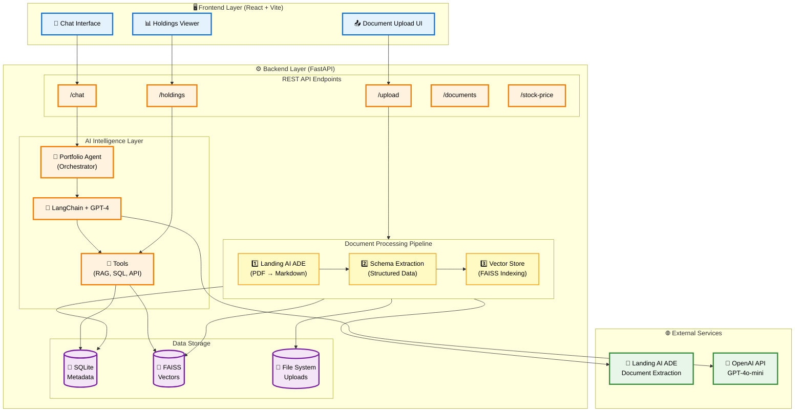
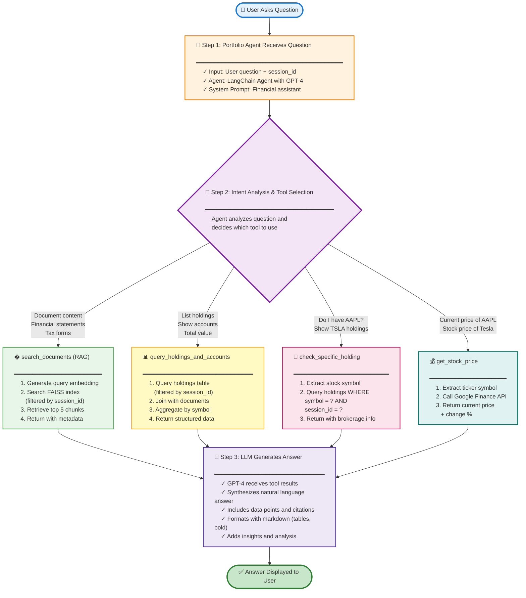

# PortfoliMosaic - AI-Powered Financial Document Assistant

**PortfoliMosaic** is an intelligent financial document analysis platform that helps you understand your investment portfolio, tax documents, and financial statements through natural language conversations.

---

***

## 📊 Problem Statement

Modern investors manage increasingly complex financial lives — across multiple brokerage firms, countries, and asset types. Yet, their tools often fail to connect fragments of financial data into actionable insights.

**Traditional portfolio management assumes:**  
- All investments are held in a single account.
- Investors focus only on domestic markets.
- Analysis is static, lacking real-time performance and risk synthesis.

**In reality, today’s investors:**
- Use multiple brokerage accounts for diversification, perks, or specialized investments.
- Hold international assets for growth and risk management.
- Need dynamic, context-aware analytics that unite all their holdings, tax docs, and financial statements.

***

## 📈 Key Metrics Highlighting the Problem

- **~25%** of U.S. investors maintain more than one brokerage account, seeking diversification, lower fees, or special features. *(Bankrate, 2025; NerdWallet, 2021)*[12][13]
- **U.S. direct investment abroad reached $6.68 trillion at end-2023,** with millions of individuals holding assets in international markets. *(BEA.gov, 2025)*[14]
- **Long-term diversified investors typically hold between 15 and 30 stocks,** with advanced models showing risk continues to decline even with 50+ stocks. *(YouTube/NDVR, 2025; Cabot Wealth, 2025)*[15][16]
- **74% of global firms cite cross-border compliance as a top challenge,** making unified investment oversight a necessity for international investors. *(eFlow Global, 2024)*


**Our solution** is extracting, aggregating, and answering complex portfolio, compliance, and risk questions from ALL your financial documents — across brokerages, countries, and asset types.

***

### Sources  
- “5 Key Benefits Of Having Multiple Brokerage Accounts.” Bankrate, 2025.  
- “Brokerage Accounts in the United States.” U.S. Department of Labor, 2015.  
- “Direct Investment by Country and Industry, 2023.” BEA.gov, 2025.  
- “How Many Stocks Do You Really Need?” YouTube/NDVR, 2025.  
- “How Many Stocks You Should Own and How to Right-Size a Portfolio.” Cabot Wealth, 2025.  
- “Global Cross-Border Compliance Trends.” eFlow Global, 2024.

***

## 📋 Table of Contents

- [What This App Is For](#-what-this-app-is-for)
- [What This App Is NOT For](#-what-this-app-is-not-for)
- [Architecture Overview](#-architecture-overview)
- [Technology Stack](#-technology-stack)
- [How It Works](#-how-it-works)
- [Local Setup](#-local-setup)
- [Usage Guide](#-usage-guide)
- [API Reference](#-api-reference)
- [Project Structure](#-project-structure)
- [Environment Variables](#-environment-variables)
---

## ✅ What This App Is For

PortfoliMosaic is designed to help you:

1. **📄 Upload Financial Documents**
   - Brokerage statements (Fidelity, Schwab, etc.)
   - Tax forms (1099-B, 1099-DIV, 1099-INT)
   - Balance sheets and financial statements
   - SEC reports (10-K, 10-Q)
   - Trade confirmations

2. **🤖 Ask Questions in Natural Language**
   - "What are my total holdings?"
   - "Show me all my Apple shares across accounts"
   - "What is the total value of assets on the balance sheet?"
   - "What dividends did I receive from Microsoft?"
   - "What is the current stock price of TSLA?"

3. **📊 Get Structured Insights**
   - Automatic extraction of holdings, transactions, and account details
   - Multi-account portfolio tracking with brokerage information
   - Company-specific financial statement analysis
   - Real-time stock price lookups

4. **🔍 Session-Based Document Management**
   - Each browser session has isolated document storage
   - Upload multiple documents from different companies
   - Ask questions specific to one company or compare across companies

---

## ❌ What This App Is NOT For

This application is **NOT**:

1. **❌ A Financial Advisor** - Does not provide investment advice or recommendations
2. **❌ A Trading Platform** - Cannot execute trades or manage your actual portfolio
3. **❌ A Tax Preparation Tool** - Does not file taxes or provide tax advice
4. **❌ A Real-Time Market Data Provider** - Stock prices are for reference only
5. **❌ A Production-Ready System** - This is a development/demo application
6. **❌ A Secure Vault** - Not designed for storing sensitive financial data long-term
7. **❌ A Multi-User Platform** - No user authentication or multi-tenant support

---

## 🏗️ Architecture Overview

### System Architecture



---

## 🛠️ Technology Stack

### Backend
- **FastAPI** - Modern Python web framework for building APIs
- **SQLAlchemy** - SQL toolkit and ORM for database operations
- **LangChain** - Framework for building LLM-powered applications
- **FAISS** - Facebook AI Similarity Search for vector storage
- **Sentence Transformers** - State-of-the-art text embeddings
- **Landing AI ADE** - Advanced Document Extraction service
- **OpenAI API** - GPT-4 for natural language understanding

### Frontend
- **React 18** - UI library for building interactive interfaces
- **Vite** - Next-generation frontend build tool
- **React Markdown** - Markdown rendering with GitHub Flavored Markdown support

### Data Storage
- **SQLite** - Lightweight database for metadata and structured data
- **FAISS** - Vector database for semantic search
- **File System** - Document storage (PDFs, extracted markdown)

### External Services
- **Landing AI ADE** - PDF parsing and structured data extraction
- **OpenAI GPT-4** - Language model for chat and reasoning

---

## 🔄 How It Works

### Document Upload Flow

```mermaid
flowchart TD
    Start([👤 User Uploads PDF]) --> Step1

    Step1["📋 Step 1: File Upload & Validation
    ━━━━━━━━━━━━━━━━━━━━━━━━━━━━
    ✓ Validate file type (PDF, XLSX, images)
    ✓ Check file size (max 50MB)
    ✓ Generate unique document ID
    ✓ Save to data/uploads/
    ✓ Create database record with session_id"]

    Step1 --> Step2

    Step2["🚀 Step 2: Landing AI ADE - PDF Parsing
    ━━━━━━━━━━━━━━━━━━━━━━━━━━━━━━━━━━━
    ✓ Send PDF to Landing AI Parse API
    ✓ Extract text, tables, and structure
    ✓ Convert to clean Markdown format
    ✓ Preserve table structure
    ✓ Save markdown to data/extracted/"]

    Step2 --> Step3

    Step3["🔍 Step 3: Landing AI ADE - Schema Extraction
    ━━━━━━━━━━━━━━━━━━━━━━━━━━━━━━━━━━━━━━━━━
    ✓ Send markdown + JSON schema to Extract API
    ✓ Extract structured data:
      • DocumentType (BalanceSheet, etc.)
      • CompanyName, TickerSymbol, ReportDate
      • Holdings (symbol, quantity, value)
      • Transactions, Account details
      • Financial statement items
    ✓ Store extraction_json in database"]

    Step3 --> Step4

    Step4["🏷️ Step 4: Document Classification
    ━━━━━━━━━━━━━━━━━━━━━━━━━━━━━━━━
    ✓ Primary: Use ADE-extracted DocumentType
    ✓ Fallback: Keyword-based classifier
    ✓ Normalize to display format
    ✓ Update document_type in database"]

    Step4 --> Step5

    Step5["💼 Step 5: Holdings Extraction & Storage
    ━━━━━━━━━━━━━━━━━━━━━━━━━━━━━━━━━━━━━
    ✓ Parse Holdings array from extraction_json
    ✓ Extract for each holding:
      • Symbol, Quantity, CurrentValue
      • CostBasis, UnrealizedGain
      • BrokerageFirm, AccountNumber
    ✓ Store in holdings table"]

    Step5 --> Step6

    Step6["✂️ Step 6: Text Chunking
    ━━━━━━━━━━━━━━━━━━━━━━━━━━
    ✓ Split markdown into chunks (~2000 chars)
    ✓ Preserve context and structure
    ✓ Create chunk metadata:
      • document_id, session_id
      • company_name, ticker_symbol
      • document_type, report_date"]

    Step6 --> Step7

    Step7["🧮 Step 7: Vector Embedding & Indexing
    ━━━━━━━━━━━━━━━━━━━━━━━━━━━━━━━━━━━━
    ✓ Generate embeddings (Sentence Transformers)
    ✓ Model: all-MiniLM-L6-v2 (384 dimensions)
    ✓ Add to FAISS index with metadata
    ✓ Save index to data/vector_index/
    ✓ Enable semantic search by session_id"]

    Step7 --> Complete

    Complete([✅ Document Ready!<br/>Status: completed])

    style Start fill:#e3f2fd,stroke:#1976d2,stroke-width:3px
    style Step1 fill:#fff3e0,stroke:#f57c00,stroke-width:2px,text-align:left
    style Step2 fill:#e8f5e9,stroke:#388e3c,stroke-width:2px,text-align:left
    style Step3 fill:#f3e5f5,stroke:#7b1fa2,stroke-width:2px,text-align:left
    style Step4 fill:#fff9c4,stroke:#f9a825,stroke-width:2px,text-align:left
    style Step5 fill:#fce4ec,stroke:#c2185b,stroke-width:2px,text-align:left
    style Step6 fill:#e0f2f1,stroke:#00796b,stroke-width:2px,text-align:left
    style Step7 fill:#ede7f6,stroke:#512da8,stroke-width:2px,text-align:left
    style Complete fill:#c8e6c9,stroke:#2e7d32,stroke-width:3px
```



### Chat/Question Answering Flow



---

## 🚀 Local Setup

### Prerequisites

- **Python 3.10+** (Python 3.11 recommended)
- **Node.js 18+** and npm
- **Git**
- API Keys:
  - [Landing AI API Key](https://landing.ai/) (required for document extraction)
  - [OpenAI API Key](https://platform.openai.com/) (required for chat)

### Step 1: Clone the Repository

```bash
git clone <repository-url>
cd PortfoliMosaic
```

### Step 2: Backend Setup

#### 2.1 Create Python Virtual Environment

```bash
# Create virtual environment
python3 -m venv .venv

# Activate virtual environment
# On macOS/Linux:
source .venv/bin/activate

# On Windows:
.venv\Scripts\activate
```

#### 2.2 Install Python Dependencies

```bash
pip install --upgrade pip
pip install -r requirements.txt
```

**Dependencies installed:**
- `fastapi` - Web framework
- `uvicorn` - ASGI server
- `sqlalchemy` - Database ORM
- `langchain` - LLM framework
- `langchain-openai` - OpenAI integration
- `faiss-cpu` - Vector database
- `sentence-transformers` - Text embeddings
- `pdfplumber`, `PyPDF2` - PDF processing
- `requests` - HTTP client
- `python-dotenv` - Environment variables

#### 2.3 Configure Environment Variables

```bash
# Copy example environment file
cp .env.example .env

# Edit .env and add your API keys
nano .env  # or use your preferred editor
```

**Required environment variables:**

```bash
# API Keys (REQUIRED)
OPENAI_API_KEY=sk-...                    # Your OpenAI API key
LANDING_AI_API_KEY=land_sk_...           # Your Landing AI API key

# File Upload Settings
UPLOAD_DIR=data/uploads                  # Directory for uploaded files
EXTRACTED_DIR=data/extracted             # Directory for extracted markdown
VECTOR_DIR=data/vector_index             # Directory for FAISS index
ALLOWED_FILE_EXT=pdf,png,jpg,jpeg,xlsx,xls
MAX_UPLOAD_MB=50

# RAG Settings
USE_AGENT=true                           # Enable LangChain Agent (recommended)

# Database
DATABASE_URL=sqlite:///./data/app.db     # SQLite database path
```

#### 2.4 Create Data Directories

```bash
mkdir -p data/uploads data/extracted data/vector_index
```

#### 2.5 Initialize Database

The database will be automatically created when you first run the application. The schema includes:
- `documents` - Document metadata and extraction results
- `holdings` - Extracted portfolio holdings
- `users` - User accounts (currently unused)

### Step 3: Frontend Setup

#### 3.1 Install Node Dependencies

```bash
cd frontend
npm install
```

**Dependencies installed:**
- `react` - UI library
- `react-dom` - React DOM renderer
- `react-markdown` - Markdown rendering
- `remark-gfm` - GitHub Flavored Markdown support
- `vite` - Build tool
- `@vitejs/plugin-react` - React plugin for Vite

#### 3.2 Return to Root Directory

```bash
cd ..
```

### Step 4: Run the Application

#### Option A: Run Backend and Frontend Separately (Recommended for Development)

**Terminal 1 - Backend:**
```bash
# Make sure virtual environment is activated
source .venv/bin/activate

# Run FastAPI backend
uvicorn backend.app.main:app --reload
```

Backend will be available at: **http://localhost:8000**

**Terminal 2 - Frontend:**
```bash
cd frontend
npm run dev
```

Frontend will be available at: **http://localhost:5173**

#### Option B: Run Backend Only (API Testing)

```bash
source .venv/bin/activate
uvicorn backend.app.main:app --reload
```

Access API documentation at: **http://localhost:8000/docs**

### Step 5: Verify Installation

1. **Check Backend Health:**
   ```bash
   curl http://localhost:8000/
   ```
   Should return: `{"message": "Portfolio Assistance API"}`

2. **Check Frontend:**
   - Open browser to http://localhost:5173
   - You should see the PortfoliMosaic interface

3. **Test Document Upload:**
   - Upload a sample PDF (brokerage statement or balance sheet)
   - Wait for processing to complete
   - Ask a question in the chat interface

---

## 📖 Usage Guide

### Uploading Documents

1. **Click "Upload Document" button** in the web interface
2. **Select a PDF file** (brokerage statement, tax form, balance sheet, etc.)
3. **Wait for processing** - You'll see progress through these stages:
   - ⏳ Uploading...
   - 📄 Parsing PDF...
   - 🔍 Extracting data...
   - ✅ Completed!
4. **Document is ready** - You can now ask questions about it

**Supported Document Types:**
- Brokerage Statements (Fidelity, Schwab, E*TRADE, etc.)
- Tax Forms (1099-B, 1099-DIV, 1099-INT)
- Balance Sheets
- Income Statements (removed from classification)
- Cash Flow Statements
- SEC Reports (10-K, 10-Q)
- Trade Confirmations
- Performance Reports

### Asking Questions

**Portfolio Questions:**
```
"What are my total holdings?"
"List all my accounts"
"Show me all my Apple shares"
"What is my total portfolio value?"
"Which stocks have the highest gains?"
```

**Document Content Questions:**
```
"What fees were charged on my brokerage statement?"
"What dividends did I receive from Microsoft?"
"Show me all transactions in November"
"What is mentioned about margin in the document?"
```

**Financial Statement Questions:**
```
"What is the total value of assets on the balance sheet?"
"What are Apple's total liabilities?"
"Show me the cash flow from operations"
"What is the shareholder equity?"
```

**Stock Price Questions:**
```
"What is the current price of AAPL?"
"Stock price of Tesla"
"How much is Microsoft trading at?"
```

**Multi-Company Questions:**
```
"What is Apple's total assets?"
"Compare Apple and Microsoft's revenue"
"Show me balance sheets for all companies"
```

### Understanding Responses

The AI assistant will:
- ✅ **Use relevant tools** to find information
- ✅ **Cite sources** with document names and company info
- ✅ **Format data** in tables for structured information
- ✅ **Provide context** and insights
- ✅ **Handle follow-up questions** in the same conversation

**Example Response:**
```
Based on your brokerage statement from Fidelity (Account: ***1234):

| Symbol | Quantity | Current Value | Gain/Loss |
|--------|----------|---------------|-----------|
| AAPL   | 100      | $18,500.00    | +$2,500.00 (+15.6%) |
| MSFT   | 50       | $19,250.00    | +$1,750.00 (+10.0%) |
| TSLA   | 25       | $6,125.00     | -$875.00 (-12.5%) |

**Total Portfolio Value:** $43,875.00
**Total Gain/Loss:** +$3,375.00 (+8.3%)
```

### Session Management

- **Each browser session is isolated** - Documents uploaded in one tab won't appear in another
- **Session ID is stored in browser** - Refresh the page to continue your session
- **Clear session** - Close the tab or clear browser storage to start fresh
- **No user accounts** - All data is session-based (not persistent across devices)

---

## 📚 API Reference

### Base URL
```
http://localhost:8000
```

### Endpoints

#### 1. Upload Document
```http
POST /api/upload
Content-Type: multipart/form-data

Parameters:
  - file: PDF file (required)
  - session_id: UUID (optional, auto-generated if not provided)

Response:
{
  "document_id": "1762635906_fcd4314e_apple_balance_sheet.pdf",
  "filename": "apple_balance_sheet.pdf",
  "status": "extracting",
  "message": "Document uploaded successfully. Processing started."
}
```

#### 2. Check Document Status
```http
GET /api/documents/{document_id}/status

Response:
{
  "document_id": "...",
  "filename": "apple_balance_sheet.pdf",
  "status": "completed",  // or "extracting", "failed"
  "document_type": "Balance Sheet",
  "created_at": "2024-11-08T10:30:00"
}
```

#### 3. Chat / Ask Question
```http
POST /api/chat
Content-Type: application/json

Body:
{
  "question": "What is the total value of assets?",
  "session_id": "0e47b4fd-d404-4517-af5f-2d81bc1065c7"
}

Response:
{
  "answer": "Based on Apple Inc.'s Balance Sheet...",
  "session_id": "0e47b4fd-d404-4517-af5f-2d81bc1065c7"
}
```

#### 4. Get Holdings
```http
GET /api/holdings?session_id={session_id}

Response:
{
  "holdings": [
    {
      "symbol": "AAPL",
      "quantity": 100,
      "current_value": 18500.00,
      "cost_basis": 16000.00,
      "unrealized_gain": 2500.00,
      "unrealized_gain_percent": 15.6,
      "brokerage_firm": "Fidelity",
      "account_number": "***1234",
      "account_type": "Individual"
    }
  ]
}
```

#### 5. Get Documents
```http
GET /api/documents?session_id={session_id}

Response:
{
  "documents": [
    {
      "document_id": "...",
      "filename": "apple_balance_sheet.pdf",
      "document_type": "Balance Sheet",
      "status": "completed",
      "created_at": "2024-11-08T10:30:00"
    }
  ]
}
```

#### 6. Get Stock Price
```http
GET /api/stock-price/{symbol}

Response:
{
  "symbol": "AAPL",
  "price": 185.50,
  "change": 2.30,
  "change_percent": 1.26,
  "timestamp": "2024-11-08T15:45:00"
}
```

#### 7. Re-extract Document
```http
POST /api/documents/{document_id}/re-extract

Response:
{
  "message": "Re-extraction started",
  "document_id": "...",
  "status": "extracting"
}
```

---

## 📁 Project Structure

```
PortfoliMosaic/
├── backend/                          # FastAPI backend
│   ├── app/
│   │   ├── __init__.py
│   │   ├── main.py                   # FastAPI application & endpoints
│   │   ├── models.py                 # SQLAlchemy database models
│   │   ├── schemas.py                # Pydantic schemas for API
│   │   ├── db.py                     # Database connection
│   │   └── services/                 # Business logic services
│   │       ├── portfolio_agent.py    # LangChain agent orchestrator
│   │       ├── landing_ai.py         # Landing AI ADE client
│   │       ├── extraction_schema.py  # JSON schema for ADE
│   │       ├── classifier.py         # Document type classifier
│   │       ├── vector_store.py       # FAISS vector database
│   │       ├── embeddings.py         # Text embedding service
│   │       ├── stock_price.py        # Stock price lookup
│   │       ├── consolidator.py       # Data consolidation
│   │       └── document_parser.py    # PDF parsing utilities
│   ├── migrations/                   # Database migrations
│   └── portfolio.db                  # SQLite database (auto-created)
│
├── frontend/                         # React frontend
│   ├── src/
│   │   ├── App.jsx                   # Main React component
│   │   └── main.jsx                  # React entry point
│   ├── index.html                    # HTML template
│   ├── package.json                  # Node dependencies
│   └── vite.config.js                # Vite configuration
│
├── data/                             # Data storage (auto-created)
│   ├── uploads/                      # Uploaded PDF files
│   ├── extracted/                    # Extracted markdown files
│   ├── vector_index/                 # FAISS index files
│   └── app.db                        # SQLite database
│
├── .env                              # Environment variables (create from .env.example)
├── .env.example                      # Example environment file
├── .gitignore                        # Git ignore rules
├── requirements.txt                  # Python dependencies
└── README.md                         # This file
```

### Key Files Explained

**Backend:**
- `main.py` - API endpoints, document processing pipeline, request handling
- `portfolio_agent.py` - LangChain agent with tools (RAG, SQL, stock price)
- `landing_ai.py` - Client for Landing AI ADE API (parse & extract)
- `extraction_schema.py` - JSON schema defining what data to extract
- `vector_store.py` - FAISS vector database with session filtering
- `models.py` - Database schema (documents, holdings, users)

**Frontend:**
- `App.jsx` - React UI with upload, chat, and holdings components
- `main.jsx` - React app initialization

**Data:**
- `uploads/` - Original PDF files
- `extracted/` - Markdown extracted from PDFs
- `vector_index/` - FAISS index + metadata pickle files
- `app.db` - SQLite database with documents and holdings

---

## 🔐 Environment Variables

### Required Variables

| Variable | Description | Example |
|----------|-------------|---------|
| `OPENAI_API_KEY` | OpenAI API key for GPT-4 | `sk-proj-...` |
| `LANDING_AI_API_KEY` | Landing AI API key for document extraction | `land_sk_...` |

### Optional Variables

| Variable | Description | Default |
|----------|-------------|---------|
| `UPLOAD_DIR` | Directory for uploaded files | `data/uploads` |
| `EXTRACTED_DIR` | Directory for extracted markdown | `data/extracted` |
| `VECTOR_DIR` | Directory for FAISS index | `data/vector_index` |
| `ALLOWED_FILE_EXT` | Allowed file extensions | `pdf,png,jpg,jpeg,xlsx,xls` |
| `MAX_UPLOAD_MB` | Maximum upload size in MB | `50` |
| `USE_AGENT` | Enable LangChain Agent | `true` |
| `DATABASE_URL` | SQLite database path | `sqlite:///./data/app.db` |

### Getting API Keys

**OpenAI API Key:**
1. Go to https://platform.openai.com/
2. Sign up or log in
3. Navigate to API Keys section
4. Create new secret key
5. Copy and paste into `.env` file

**Landing AI API Key:**
1. Go to https://landing.ai/
2. Sign up for an account
3. Navigate to API section
4. Generate API key
5. Copy and paste into `.env` file

---

## 🐛 Troubleshooting

### Common Issues

**1. "Module not found" errors**
```bash
# Make sure virtual environment is activated
source .venv/bin/activate

# Reinstall dependencies
pip install -r requirements.txt
```

**2. "Landing AI API rate limit exceeded"**
- Wait a few minutes before retrying
- Landing AI has rate limits on the free tier
- Consider upgrading your Landing AI plan

**3. "OpenAI API key invalid"**
- Check that your API key is correct in `.env`
- Ensure you have credits in your OpenAI account
- Verify the key starts with `sk-proj-` or `sk-`

**4. "Database locked" errors**
- Close any other processes accessing the database
- Delete `data/app.db` and restart (will lose data)

**5. Frontend can't connect to backend**
- Ensure backend is running on port 8000
- Check CORS settings in `main.py`
- Verify frontend is configured to use `http://localhost:8000`

**6. Document processing stuck at "extracting"**
- Check backend logs for errors
- Verify Landing AI API key is valid
- Try re-extracting the document via API

### Debug Mode

Enable debug logging:
```bash
# Run backend with debug logs
uvicorn backend.app.main:app --reload --log-level debug
```

---

## 🤝 Contributing

This is a development/demo project. Contributions are welcome!

**Areas for improvement:**
- User authentication and multi-tenancy
- Support for more document types
- Enhanced financial analysis features
- Better error handling and validation
- Performance optimizations
- Unit and integration tests

---

## 📄 License

This project is for educational and demonstration purposes.

---

## 🙏 Acknowledgments

- **Landing AI** - Advanced Document Extraction (ADE) service
- **OpenAI** - GPT-4 language model
- **LangChain** - LLM application framework
- **FAISS** - Vector similarity search
- **FastAPI** - Modern Python web framework
- **React** - UI library

---

## 📞 Support

For issues or questions:
1. Check the [Troubleshooting](#-troubleshooting) section
2. Review API documentation at `http://localhost:8000/docs`
3. Check backend logs for error messages

---

**Built with ❤️ for financial document analysis**
